# SPC Bench/Insitu Experiments Revisited

Background: Spcbench 
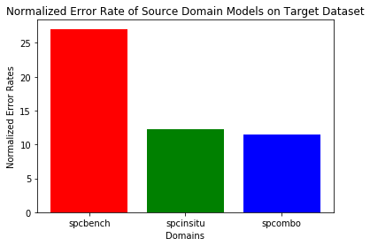

Normalized Error Rate (average of true positives errors to counter class imbalance)

* spcbench: 27.051%
* spcinsitu: 12.311%
* spcombo: 14.793%

## Goal: 
* Improve spcbench or spcombo performance to beat spcinsitu performance

## Procedure:
1) Add initially excluded Bench Copepod specimens to datasets and redo SPCBench & SPCombo experiments
2) Compare refined SPCBench images with original SPCBench images
3) Artifically augment the network to train for robustness against blurry images

### 1) Adding more data
#### SPCBench Dataset Statistics
* 27 Copepod specimens -> 59 Copepod specimens ~ 2x more specimens
* 10464 Copepod images -> 23469 Copepod images

| Calanoida        | Cyclopoida & Poecilomastoida          |
| ------------- |:-------------:|
| 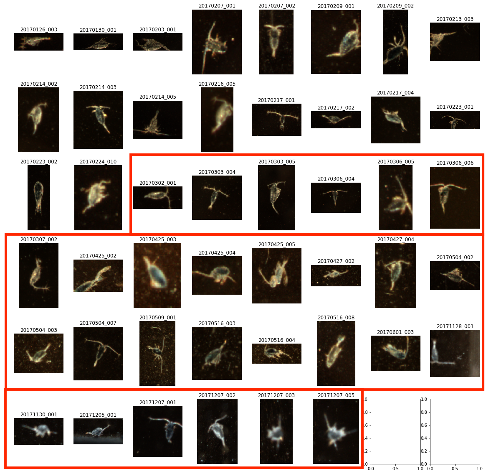     | 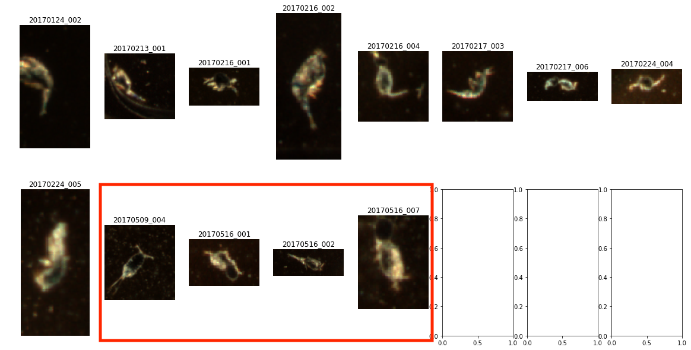|
*Red boxes indicate new specimens

#### SPCInsitu Dataset Statistics
* 2,356 Copepod Images
* 3,404 Non-Copepod Images

100 random samples of each class below

| Copepod        | Non-Copepod           |
| ------------- |:-------------:|
| 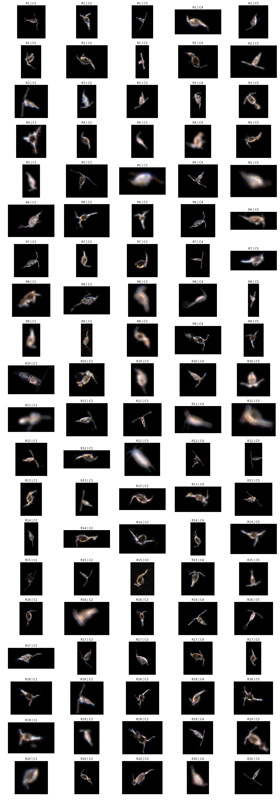      | 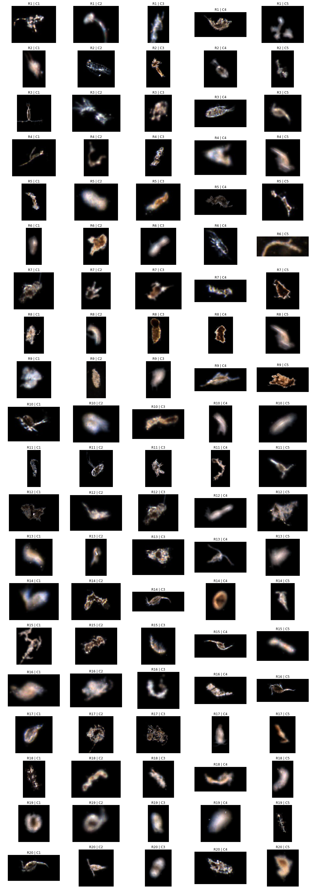 |

#### Target Dataset Statistics
The target dataset is also pulled from the same source of images as the SPCInsitu, hence the similarity in images.

* 2,720 Copepod Images
* 23,049 Copepod Images

Below is a visualization of the target dataset.

| Copepod        | Non-Copepod           |
| ------------- |:-------------:|
| 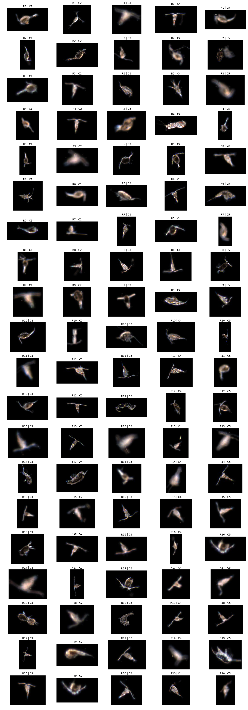      | 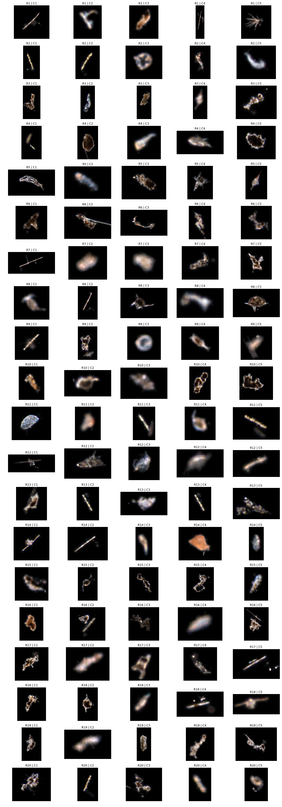 |

### Results
| SourceDomains        | Baseline           | New dataset           | Conv1 - Finetuning   |
| ------------- |:-------------:|:-------------:|:-------:|
| SPCBench      | 27.051%       | 24.824%       |         |
| SPCInsitu     | 12.311%       | ---           |   ---   |
| SPCombo       | 13.052%       | 11.325%       | 11.457% |

Remarks from Confusion Matrix Analysis
* (SPCBench) 15% increase for true positive detection, but tradeoff with less precision, implying less confidence with predicting a copepod. 85% of the time, it will correctly classify a copepod.
* (SPCombo) Better with identifying true negatives by 7% and reached same precision as Insitu Model. Overall better model.
* All models have very similar recall rate of 85%, implying a representation problem within the test set, that is not included in the training set.

### Next Steps
* Fix test set

### 2) Optimizing SPCBench images

During discussions of results from our previous classification experiments, we decided to investigate a new direction with trying to improve image properties of the SPCBench system
to boost the utility of SPCBench images, when annotating SPCInsitu images. We will be referring to these refined images as BenchV1b and original as BenchV1a. Below
is a visualization of the V1a and V1b images.

| V1a      | V1b      | SPCInsitu    |
| :-----: | :-----: | :-----: |
| 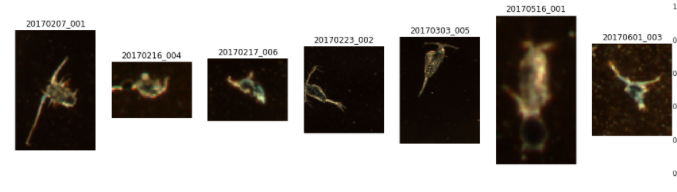      | 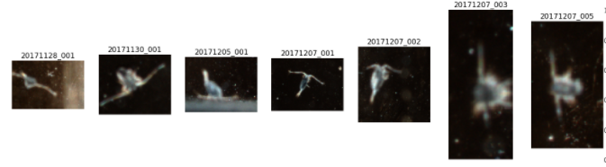       | 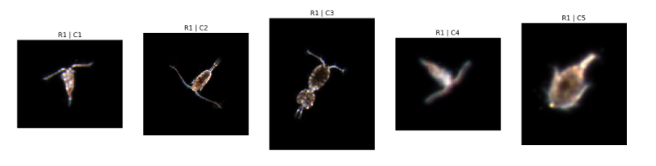    |

Dataset Statistics
* Constrained to 7 specimens, which were randomly sampled for V1a and all specimens for V1b were all utilized.
* V1a: 2752 Copepod images, V1b: 2000 Copepod images
* Data combined with SPCInsitu Images (Copepod: 2356 images, NonCopepod: 3404 images)

Image Preprocessing
* No grayscale color conversion was utilized here to test the raw utility of the Bench images

### Results
|   | V1a  | V1b  |
|---|:---:|:---:|
| Normalized Error Rate  | 26.44%  | 19.10%  |
| Confusion Matrix  | 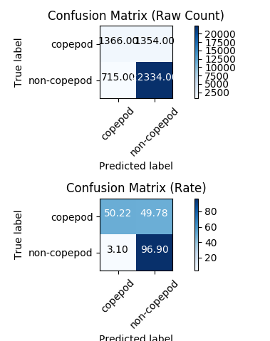 | 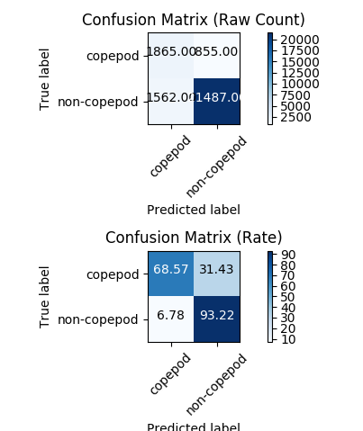 |

Analysis
* 15% increase in true positive detection for copepods, implying that similar image properties to SPCInsitu does play a role in classification performance
* Results succeeded in this area, but there is still a strong class imbalance in the test set. 